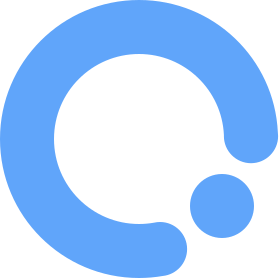
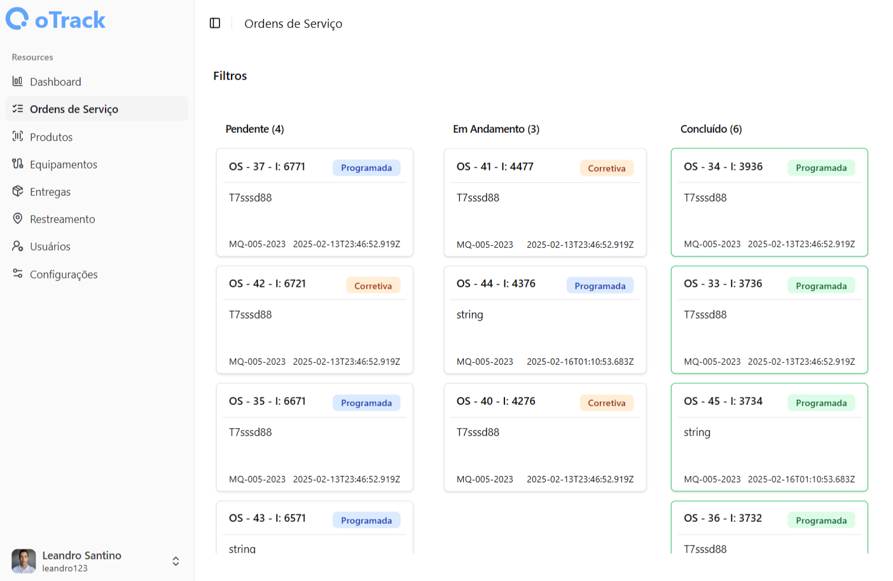

<div align="center">
  <h1>  oTrack</h1>
  
</div>
<br>


<div align="center" >

  <p>
    <i>
      "O oTrack é um sistema, destinado facilitar a gestão de atendimentos de chamados de suporte técnico de equipamentos de limpeza profissional, semelhante a um sistema de gestão de ordens de serviço."
    </i>
  </p>

  <br>

  

</div>


<br>

## 🛠️ Funcionalidades Principais

- **Autenticação e Autorização**: Controle de acesso com diferentes níveis de permissão (Administrador, Técnico, Gestão).
- **Gestão de Ordens de Serviço**: Abertura e acompanhamento de OS, categorizadas como preventiva ou por solicitação do cliente.
- **Agendamento de Entregas**: Possibilidade de programar entregas e designar entregadores.
- **Atendimento da OS**: Registro detalhado do atendimento com checklist, status e tempo de execução.
- **Cadastro e Gestão de Dados**:
  - **Equipamentos**: Modelo, número de série, cliente associado, etc.
  - **Produtos**: Descrição, tipo, etc.
  - **Clientes**: Contato, histórico de ordens de serviço, etc.
- **Histórico de Atendimento**: Consulta detalhada com filtros por data, status e técnico responsável.
- **Dashboard Gerencial**: Métricas e indicadores para acompanhamento da operação.
- **Monitoramento por GPS**: Rastreamento de técnicos e entregadores em tempo real.

<br>

## 🚀 Tecnologias Utilizadas

- **TypeScript**: Linguagem principal do projeto.
- **Node.js**: Back-end da aplicação.
- **React Js**: Front-end da aplicação web.
- **React Native**: Tecnologia do Aplicativo mobile
- **PostgreSQL**: Banco de dados relacional.
- **Swagger**: Documentação automática da api.
- **Docker & Docker Compose**: Orquestração dos serviços.

<br>

## 📝 Metodologia

- **Clean Architecture**: Separação clara das responsabilidades em camadas (entities, use cases, controllers, repositories), seguindo os princípios de Clean Architecture.
- **SOLID**: Aplicação dos princípios SOLID para garantir um código modular, extensível e de fácil manutenção.

<br>

## 📦 Como Executar o Projeto

### 1️⃣ Clonar o repositório

```sh
git clone https://github.com/leandrosantino/otrack.git
cd otrack
```

### 2️⃣ Configurar o ambiente
Certifique-se de ter Docker e Docker Compose instalados.

### 3️⃣ Compilar app web
```sh
cd web
npm run build
```

### 4️⃣ Compilar api
```sh
cd api
npm run build
```

### 5️⃣ Subir os containers
Volte para o diretório principal e rode o seguinte comando:
```sh
docker-compose up -d
```
O sistema estará disponível em http://localhost:5173

<br>

## 📌 Documentação da API
Após subir os containers, acesse o endpoint abaixo para visualizar a documentação da API.

```
GET http://localhost:3000/docs
```

<br>

## ⚠️ Observação

Este projeto está em desenvolvimento e pode sofrer alterações.

<br>

## 📜 Licença

Este projeto é licenciado sob a licença MIT. Veja o arquivo LICENSE para mais detalhes.
